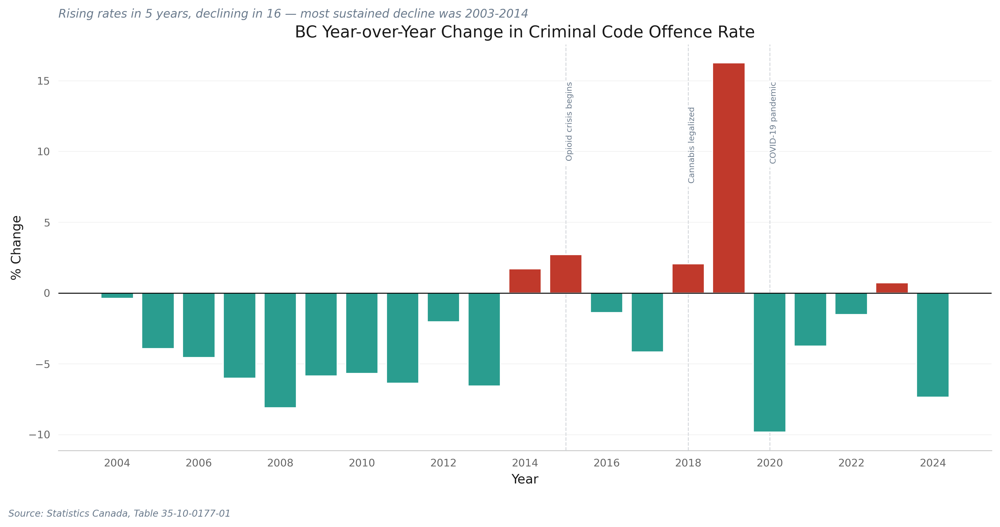

# Exploring the Crime Landscape in British Columbia

**A data-driven analysis of crime severity, composition, justice system effectiveness, and geographic distribution across BC (2004--2024)**

*Kacper Ruta | Data sourced from Statistics Canada and the BC Ministry of Public Safety*

---

## Table of Contents

1. [Key Findings at a Glance](#key-findings-at-a-glance)
2. [Is Crime Rising? (Figures 1--8)](#1-is-crime-rising)
3. [What Kinds of Crime Are Changing? (Figures 9--16)](#2-what-kinds-of-crime-are-changing)
4. [How Effectively Is Crime Being Addressed? (Figures 17--23)](#3-how-effectively-is-crime-being-addressed)
5. [Where Is Crime Concentrated? (Figures 24--30)](#4-where-is-crime-concentrated)
6. [Methodology](#methodology)
7. [Caveats](#caveats)
8. [Technical Details](#technical-details)

### List of Figures

| # | Figure | What It Shows | Key Insight |
|---|--------|---------------|-------------|
| 1 | BC CSI trend | Total, violent, and non-violent Crime Severity Index over time | CSI fell 46% from peak to 2014 trough; violent CSI rising relative to non-violent since 2014 |
| 2 | Violent vs non-violent ratio | Ratio of violent CSI to non-violent CSI | Ratio rose from 0.73 to ~1.0 — violent and non-violent severity now roughly equal |
| 3 | BC YoY changes | Year-over-year percentage change in BC crime rate | 2004--2014 shows near-continuous decline; post-2019 trend is again downward |
| 4 | Provincial small multiples | Crime rate panels for 6 provinces | All provinces share the same broad arc; Saskatchewan consistently highest |
| 5 | Indexed provincial trajectories | Provinces indexed to 2004 = 100 | BC declined the steepest (-42% by 2014), then partially rebounded |
| 6 | BC vs Canada gap | BC and Canada crime rates with shaded gap | BC persistently ~20% above the national average |
| 7 | Provincial YoY comparison | Latest year-over-year change by province | BC's recent decline is among the steepest nationally |
| 8 | CSI contribution breakdown | Top 12 violations by CSI contribution | A small number of offence types drive the majority of BC's CSI score |
| 9 | Stacked area composition | Crime rate by category, stacked over time | Property crime dominates but declining; violent crime holds steady |
| 10 | 100% stacked shares | Category shares as percentage of total | Property share fell 64% to 51%; violent grew 12% to 20% |
| 11 | Rate heatmap | Year-by-year intensity by category | Administration of justice violations warming notably over time |
| 12 | Top changes bar chart | Top 10 violations by absolute rate change | Theft from motor vehicles fell -772/100k; child exploitation rose +82/100k |
| 13 | Category ranking slope | Category rankings, 2014 vs latest year | Property crime remains #1; drug offences fell in rank |
| 14 | CAGR lollipop | 5-year compound annual growth rate by category | Drug offences declining fastest (-8.3%); violent crime slowest (-0.8%) |
| 15 | Violation trend small multiples | 2x4 panels for 8 highest-rate violations | Diverse trajectories beneath the aggregate — some declining, others surging |
| 16 | Rising violations overlay | 5 fastest-growing violations overlaid | Emerging pressure points not visible in aggregate statistics |
| 17 | Clearance rate trends | Clearance rate by category over time | Property crime clearance far lower than violent crime clearance |
| 18 | Clearance by violation type | Clearance rate for top 10 violations by volume | Wide range from <20% (theft) to >70% (assault) |
| 19 | Youth vs adult CSI | Youth and overall CSI compared | Youth CSI declining even as overall CSI rises — divergent trajectories |
| 20 | RCMP vs municipal policing | Crime counts by policing type | Municipal police forces handle the largest share of offences |
| 21 | COVID impact analysis | Pre-COVID vs pandemic vs post-pandemic rates | Property crime dropped mid-pandemic; some categories largely unaffected |
| 22 | Unfounded rates | Percent unfounded by category | Property crime has the highest unfounded rate; violent crime the lowest |
| 23 | Underreporting proxies | 2x2 dashboard: unfounded rates, clearance methods, indexed rates, GSS context | Only 29% of victimizations are reported; property crime decline may partly reflect reporting changes |
| 24 | Top 20 jurisdictions | Jurisdictions ranked by total crime count | Municipal police forces in Metro Vancouver dominate the rankings |
| 25 | 8 largest jurisdiction trends | Small multiples for top 8 jurisdictions | Divergent trajectories — local factors matter as much as provincial trends |
| 26 | CMA rate comparison | Per-capita crime rates across BC CMAs | Interior CMAs report ~2x higher per-capita crime than coastal metros |
| 27 | CMA trends | CMA crime rate trends over time | Abbotsford-Mission halved from peak; Kelowna relatively flat |
| 28 | Total vs violent scatter | Total vs violent offences by jurisdiction | r = 0.99 — high-crime areas have proportionally more violence |
| 29 | Pareto concentration curve | Cumulative share of crime by jurisdiction | 5% of jurisdictions account for 50% of all crime |
| 30 | Violent share distribution | Distribution of violent crime share across jurisdictions | Average violent share ~26%, but wide variance (15%--50%+) |
| S1 | BC policing expenditure trend | Real vs nominal policing spending over time | Policing costs have outpaced inflation |
| S2 | Per-capita policing comparison | Per-capita policing spending across provinces | BC spending above national average |
| S3 | CSI vs expenditure | Crime severity overlaid with policing expenditure | Rising spending has not proportionally reduced crime severity |
| S4 | Expenditure breakdown | Policing expenditure by component | Personnel costs dominate total expenditure |
| S5 | Police staffing trend | Officers per 100,000 population over time | Staffing adequacy relative to population |
| S6 | Crimes per officer | Criminal Code incidents per officer with CSI overlay | Workload per officer trends |
| — | BC Gov YoY 2022-2023 | Year-over-year change by crime category (BC Gov data) | 17 categories rising, 14 declining between 2022 and 2023 |
| — | Region comparison | Small multiples of crime trends by BC region | Strathcona, Central Okanagan fastest-growing; Metro Vancouver declining |
| -- | Interactive jurisdiction map | Plotly HTML with hover details for 50 jurisdictions | Explore violent, property, and total offence breakdowns interactively |

---

## Key Findings at a Glance

> 1. **BC's Crime Severity Index fell ~46%** from its 2004 peak to a trough of 90 in 2014. The 2024 reading of 92 reflects a **7.4% year-over-year decline**, but BC remains roughly **21% above the national average**.
> 2. **Violent and non-violent CSI have converged.** The violent-to-non-violent ratio rose from ~0.73 in the mid-2000s to approximately **1.0** -- violent and non-violent severity are now roughly equal.
> 3. **Property crime's share dropped from 64% to 51%** over two decades; violent crime's share **grew from 12% to 20%**, a compositional shift toward more serious offences.
> 4. **Child exploitation offences (+82/100k) and shoplifting (+79/100k)** are the sharpest rising categories, while theft from motor vehicles fell by **-772/100k** over five years.
> 5. **Drug offences are declining fastest** (CAGR of -8.3%); violent crime is declining slowest (CAGR of -0.8%), reinforcing the compositional shift.
> 6. **Interior CMAs have roughly double** the per-capita crime rate of coastal metros -- Chilliwack (11,352/100k) and Kamloops (10,546/100k) vs. Vancouver (5,438/100k) and Victoria (5,283/100k).
> 7. **Crime is extremely concentrated**: just **5% of jurisdictions account for 50%** of all Criminal Code offences; 19% account for 80%.
> 8. **Total and violent offences correlate at r = 0.99** across jurisdictions -- high-crime areas have proportionally more violent crime, not just more property crime.

---

## 1. Is Crime Rising?

BC's overall Crime Severity Index has followed a clear arc: a sustained decline through 2014, a partial rebound peaking around 2019, and a renewed decline through 2024. The most recent data shows a 7.4% year-over-year drop to a CSI of 92.

What makes the recent period notable is the divergence between violent and non-violent CSI. While the non-violent index has tracked the overall downward trend, the violent CSI has risen more steeply since 2014 -- suggesting a compositional shift toward more serious offences even as overall severity falls.


*Figure 1. BC's Crime Severity Index by component. The total CSI (dark blue) fell 46% from peak to trough before stabilizing. The violent CSI (red) has risen relative to non-violent since 2014. Source: Statistics Canada, Table 35-10-0063-01.*

The violent-to-non-violent CSI ratio quantifies this compositional shift precisely. The ratio bottomed at 0.73 in the mid-2000s and has since risen to approximately 1.0 -- meaning violent and non-violent crime severity are now roughly equal, where two decades ago non-violent crime dominated.


*Figure 2. Ratio of violent to non-violent CSI. A rising ratio confirms the compositional shift toward more serious offences. When the ratio exceeds 1.0, violent crime severity surpasses non-violent. Source: Statistics Canada, Table 35-10-0063-01.*

The year-over-year perspective reveals the rhythm of change more clearly. Declining years dominate the 2004--2014 stretch, while rising years cluster around 2015--2019, coinciding with the opioid crisis and rising property crime in the Lower Mainland. The most recent year confirms the renewed downward trend.


*Figure 3. Year-over-year percentage change in BC's Criminal Code offence rate. The 2004--2014 period shows near-continuous decline; the post-2019 trend is again downward. Source: Statistics Canada, Table 35-10-0177-01.*

Placing BC in a national context, every major province experienced the same broad pattern -- decline through the mid-2010s, a plateau or slight rise, and renewed decline. However, absolute levels differ substantially. Saskatchewan's offence rate consistently runs roughly double Ontario's. BC sits above the national average, closer to Alberta and Manitoba.


*Figure 4. Criminal Code offence rates (excluding traffic) per 100,000 population across six provinces, 2004--2024. Source: Statistics Canada, Table 35-10-0177-01.*

When all provinces are indexed to their 2004 crime rate (= 100), the trajectories become directly comparable regardless of absolute level. BC shows the steepest decline among comparison provinces, reaching roughly 58 by 2014 -- a 42% drop. The post-2014 rebound is visible across all provinces but has since reversed.


*Figure 5. Provincial crime rate trajectories indexed to 2004 = 100. BC (bold blue) declined the steepest, then rebounded before resuming decline. Source: Statistics Canada, Table 35-10-0177-01.*

BC's crime rate has persistently exceeded the national average. The gap narrowed substantially from 2004 to 2014 as BC's decline outpaced the national trend, but has since stabilized at roughly 20% above the national rate. This persistent gap raises questions about structural factors specific to BC.


*Figure 6. BC vs Canada crime rate with the excess gap shaded. BC has remained above the national average for the entire period, though the gap narrowed through 2014. Source: Statistics Canada, Table 35-10-0177-01.*

The most recent year-over-year comparison across provinces shows BC's decline is among the steepest nationally, suggesting the post-2019 downward trend reflects province-specific factors beyond the broader national pattern.


*Figure 7. Year-over-year change in Criminal Code offence rate by province. BC is highlighted in blue; grey bars show comparison provinces. Source: Statistics Canada, Table 35-10-0177-01.*

Decomposing the CSI into its contributing offence categories reveals which crime types are driving the aggregate index. This breakdown shows the relative weight each category contributes to the overall severity measure, distinguishing between the volume-driven property categories and the severity-weighted violent categories.


*Figure 8. CSI contribution breakdown showing the relative weight of each offence category to BC's overall Crime Severity Index. Severity weighting means violent offences contribute disproportionately to the total despite lower volumes. Source: Statistics Canada, Table 35-10-0063-01.*

---

## 2. What Kinds of Crime Are Changing?

The composition of crime in BC has shifted substantially over two decades. While total crime rates have declined, the mix of offences has changed in ways that have significant implications for policing priorities and public safety. Property crime still dominates by volume, but its declining share means other categories -- particularly violent crime and administration of justice violations -- now make up a larger proportion of the total.


*Figure 9. BC crime composition by category (rate per 100,000), 2004--2024. Property crime dominates but is declining, while violent crime holds relatively steady. Source: Statistics Canada, Table 35-10-0177-01.*

The 100% stacked view makes the compositional shift explicit. Property crime's share declined from 64% in 2004 to 51% in 2024, while violent crime grew from roughly 12% to 20%. Administration of justice violations also grew as a proportion -- a trend that may reflect stricter bail enforcement.


*Figure 10. Crime composition as share of total (%), 2004--2024. Property crime's declining share and violent crime's rising share confirm the compositional shift. Source: Statistics Canada, Table 35-10-0177-01.*

The heatmap provides a year-by-year intensity view of each crime category. Warmer colours indicate higher rates. Property crime cells show a gradual cooling trend, while administration of justice violations warm notably from left to right -- a pattern consistent with policy changes around breach and bail offences.


*Figure 11. Heatmap of BC crime rates by category and year. Each cell shows the rate per 100,000. Source: Statistics Canada, Table 35-10-0177-01.*

The absolute rate change over the last five years identifies which specific offences are driving the aggregate trends. Theft from motor vehicles saw the single largest decline at -772 per 100,000, followed by breaking and entering and theft under $5,000. On the rising side, child exploitation offences and shoplifting both increased -- two categories that warrant targeted policy attention.


*Figure 12. Top 10 violations by absolute rate change over five years. Declining offences in teal; increases in red. Source: Statistics Canada, Table 35-10-0177-01.*

The slope chart ranks the five main crime categories by rate in 2014 versus the latest year. Property crime remains dominant in absolute terms; the key movements are administration of justice rising in rank and drug offences falling -- reflecting both decriminalization trends and stricter bail enforcement.


*Figure 13. Slope chart of crime category rankings, 2014 vs latest year. Source: Statistics Canada, Table 35-10-0177-01.*

The compound annual growth rate normalizes changes for both time and base rate. Over the most recent five years, all five categories are declining, but at vastly different rates. Violent crime's CAGR of just -0.8% confirms it is declining the slowest -- further evidence that the crime mix is shifting toward more serious offences.


*Figure 14. Compound annual growth rate by crime category. Drug offences are declining fastest (-8.3%); violent crime is declining slowest (-0.8%). Source: Statistics Canada, Table 35-10-0177-01.*

Drilling into specific violation types reveals the individual offence trends that aggregate figures can obscure. The small multiples below show eight selected violations across different crime categories, each with its own trajectory -- some declining steadily, others surging or plateauing.


*Figure 15. Trend lines for eight selected Criminal Code violations, showing the diversity of trajectories beneath the aggregate numbers. Source: Statistics Canada, Table 35-10-0177-01.*

Focusing on the violations that are rising fastest, the overlay chart highlights those offences whose rates have increased most sharply in recent years. These rising violations, while sometimes small in absolute terms, represent emerging pressure points that may require proactive policy responses before they grow further.


*Figure 16. Overlay of the fastest-rising Criminal Code violations in BC. These emerging trends are not yet visible in aggregate statistics. Source: Statistics Canada, Table 35-10-0177-01.*

BC Government data provides a complementary lens on the most recent year-over-year changes. Comparing 2022 and 2023 incident counts across individual crime categories reveals a mixed picture: 17 categories rose while 14 declined, with the largest percentage increases in categories that are often underrepresented in aggregate statistics.


*Year-over-year percentage change in incident counts by crime category, 2022 vs 2023. Red bars indicate increases; teal bars indicate decreases. Source: BC Government, Crime Statistics in BC 2023 (Appendix F).*

---

## 3. How Effectively Is Crime Being Addressed?

Sections 1 and 2 examined how much crime BC has and what kinds. This section shifts the lens to the justice system's response: how effectively are crimes being cleared, how do outcomes differ by policing model, and what structural patterns emerge when we disaggregate by age group and offence type?

Clearance rates -- the share of reported incidents that result in a charge or are otherwise resolved -- provide the most direct measure of police effectiveness. Tracking clearance rates by crime category over time reveals whether the justice system's capacity to resolve cases has kept pace with the changing crime mix.


*Figure 17. Clearance rate trends by major crime category. Clearance rates vary widely by offence type, and the trends over time reveal shifting enforcement priorities and capacity constraints. Source: Statistics Canada, Table 35-10-0063-01.*

Breaking clearance rates down further by specific violation type shows where the justice system is most and least effective. Some offences -- particularly those with identifiable victims and clear evidence -- are cleared at high rates, while others present persistent investigative challenges.


*Figure 18. Clearance rates by specific violation type, showing the wide range between offence categories. Source: Statistics Canada, Table 35-10-0063-01.*

Youth and adult crime follow different trajectories. Comparing the youth and adult Crime Severity Indices over time reveals whether the factors driving overall crime trends affect young offenders differently -- an important distinction for prevention-oriented policy.


*Figure 19. Youth vs adult Crime Severity Index. Divergences between the two series point to age-specific factors in crime trends that aggregate figures obscure. Source: Statistics Canada, Table 35-10-0063-01.*

BC's policing is split between RCMP detachments (serving most of the province by area) and independent municipal police forces (serving the largest cities). Comparing crime outcomes across these two models tests whether organizational structure correlates with measurable differences in crime patterns or clearance performance.


*Figure 20. Crime metrics compared across RCMP-policed and municipally-policed jurisdictions. Structural differences in policing models may influence reported crime rates and clearance outcomes. Source: BC Government, Police Resources in British Columbia.*

The COVID-19 pandemic disrupted crime patterns across every category. Lockdowns, reduced mobility, economic support programs, and changes in reporting behaviour all contributed to anomalous 2020--2021 data. This chart isolates the pandemic's impact to help distinguish genuine trends from temporary distortions -- a critical lens for interpreting the post-2019 decline (see Caveat 2).


*Figure 21. COVID-19 impact analysis showing how pandemic-era disruptions affected crime categories differently. Some offences dropped sharply during lockdowns while others were largely unaffected. Source: Statistics Canada, Table 35-10-0177-01.*

Not all reported incidents result in founded criminal cases. The unfounded rate -- the share of reports that police determine did not occur or did not constitute a criminal offence -- varies significantly by offence type and has implications for both victims and the accuracy of crime statistics.


*Figure 22. Unfounded rates across offence categories. Higher unfounded rates may reflect investigative complexity, reporting patterns, or systemic factors in how certain offence types are assessed. Source: Statistics Canada, Table 35-10-0063-01.*

### The Reporting Gap: Could Underreporting Explain the Decline?

A natural question arises from the data in Sections 1--2: could the apparent decline in crime rates reflect less crime being *reported* rather than less crime actually occurring? This is not a hypothetical concern. Statistics Canada's [General Social Survey on Canadians' Safety (2019)](https://www150.statcan.gc.ca/n1/pub/85-002-x/2021001/article/00014-eng.htm) found that only **29% of criminal victimizations** were reported to police (Cotter, 2021, *Juristat*, Catalogue no. 85-002-X). Reporting rates vary dramatically by offence type: property crime sits at roughly 35%, violent crime at 24%, and sexual assault at just 6%.

This means the police-reported data underlying every chart in this analysis captures less than a third of actual criminal victimization. If reporting rates are declining over time, then falling police-reported rates could coexist with stable or even rising actual crime.

To investigate, we can examine proxy indicators available in the police data itself:

1. **Unfounded rates** -- If police are classifying more reports as "unfounded" (i.e., determining they did not occur), this artificially suppresses crime counts. Panel 1 of Figure 23 tracks unfounded rates for specific violations over time.

2. **Clearance method shifts** -- A growing share of cases "cleared otherwise" (rather than by charge) may indicate victims declining to proceed with complaints, consistent with reporting fatigue. Panel 2 tracks this ratio.

3. **Differential decline rates** -- If underreporting is the primary driver, we would expect the steepest declines in offence categories with the lowest reporting rates. Panel 3 compares property crime (higher reporting rate, ~35%) and violent crime (lower reporting rate, ~24%) trajectories.


*Figure 23. Underreporting proxy dashboard. Top-left: unfounded rates for specific violations. Top-right: share of cleared cases resolved by charge vs otherwise. Bottom-left: property vs violent crime indexed to 2004. Bottom-right: GSS victimization survey context. Sources: Statistics Canada Tables 35-10-0177-01 and 35-10-0063-01; GSS on Canadians' Safety, 2019.*

**Assessment.** The proxy data provides partial support for the underreporting hypothesis. Property crime -- which has a higher reporting rate and is therefore less sensitive to reporting changes -- has declined more steeply than violent crime. This is the *opposite* of what we would expect if declining reporting rates were the sole driver. However, the GSS data confirms that the vast majority of crime goes unreported, making it impossible to fully distinguish genuine crime reduction from reporting changes using police data alone. The most defensible conclusion is that underreporting likely contributes to some of the property crime decline (particularly for low-value theft) but cannot explain the violent crime trends, which are driven by distinct factors including the opioid crisis and changing enforcement priorities.

### Policing Costs and Cost-Effectiveness

How much does BC spend on policing, and is the investment producing results? Statistics Canada's police administration survey (Table 35-10-0076-01) provides expenditure, staffing, and workload data spanning 1986--2023, enabling a long-run view of cost-effectiveness.


*Figure S1. BC policing expenditure over time in nominal and CPI-adjusted (real) dollars. Spending has risen steadily, outpacing general inflation. Source: Statistics Canada, Table 35-10-0076-01.*


*Figure S2. Per-capita policing expenditure across Canadian provinces. BC consistently ranks above the national average. Source: Statistics Canada, Table 35-10-0076-01.*


*Figure S3. BC Crime Severity Index overlaid with policing expenditure. Rising spending has not translated into proportional reductions in crime severity, raising questions about cost-effectiveness. Sources: Statistics Canada, Tables 35-10-0076-01 and 35-10-0063-01.*


*Figure S4. Policing expenditure breakdown. Personnel costs dominate, accounting for the majority of total policing expenditure. Source: Statistics Canada, Table 35-10-0076-01.*

Staffing levels provide another dimension. The number of police officers per 100,000 population measures whether the force is keeping pace with a growing province.


*Figure S5. Police officers per 100,000 population in BC. Staffing adequacy relative to population growth. Source: Statistics Canada, Table 35-10-0076-01.*

Combining staffing with crime data yields a workload measure: how many Criminal Code incidents does each officer handle? When overlaid with the Crime Severity Index, this reveals whether declining crime has translated into reduced workload or whether other demands have absorbed the capacity.


*Figure S6. Criminal Code incidents per police officer in BC, with CSI trend overlay. Source: Statistics Canada, Tables 35-10-0076-01 and 35-10-0063-01.*

---

## 4. Where Is Crime Concentrated?

Aggregate provincial statistics mask enormous variation at the local level. This section examines how crime is distributed across BC's policing jurisdictions and Census Metropolitan Areas, revealing patterns of geographic concentration that have direct implications for resource allocation.

Raw offence counts are dominated by population -- Vancouver and Surrey account for the largest volumes simply because they are the most populous. The chart below ranks the top 20 policing jurisdictions by total Criminal Code offences, distinguishing municipal police forces from RCMP detachments.


*Figure 24. Top 20 BC policing jurisdictions by total Criminal Code offence count (latest year). Source: BC Government, Police Resources in British Columbia.*

The small multiples below show how crime counts have evolved over time in BC's eight largest policing jurisdictions. The trajectories diverge: some show clear declines, others have plateaued, and a few show modest increases -- suggesting that local factors matter as much as provincial trends.


*Figure 25. Crime trends in BC's 8 largest policing jurisdictions. Divergent trajectories indicate that local conditions drive outcomes as much as province-wide forces. Source: BC Government, Police Resources in British Columbia.*

Among BC's Census Metropolitan Areas, Chilliwack leads at 11,352 offences per 100,000 population, followed by Kamloops (10,546), Nanaimo (9,365), and Kelowna (8,922). The large coastal metros -- Vancouver (5,438) and Victoria (5,283) -- sit at the bottom. Interior CMAs consistently record per-capita crime rates roughly double those of the major urban centres.


*Figure 26. Criminal Code offence rate per 100,000 across BC Census Metropolitan Areas (latest year). Interior CMAs significantly outpace coastal metros. Source: Statistics Canada, Table 35-10-0177-01.*

The CMA trend charts add temporal context. Abbotsford-Mission's rate roughly halved from its 2004 peak, while Kelowna's rate has been relatively flat. Chilliwack and Kamloops have data from more recent years, showing elevated but declining rates. These divergent trajectories caution against treating "BC" as a single story (see Caveat 3 on CMA boundary changes).


*Figure 27. Crime rate trends across BC CMAs, 2004--2024. Trajectories diverge -- Abbotsford-Mission declined sharply while Kelowna held steady. Source: Statistics Canada, Table 35-10-0177-01.*

Aggregating jurisdiction-level data by region reveals which parts of BC are experiencing the sharpest increases. The small multiples below show crime count trends for the top 12 regions by volume, highlighting divergent trajectories -- with some interior regions seeing substantial increases while Metro Vancouver's counts have declined.


*Crime count trends by BC region (top 12 by volume), 2014--2023. Strathcona, Central Okanagan, and Thompson Nicola show the largest increases; Metro Vancouver is the only declining region among the top 12. Source: BC Government, Police Resources in British Columbia.*

A scatter plot of total offences against violent offences reveals a near-perfect linear relationship (r = 0.99). Jurisdictions with more crime overall have proportionally more violent crime -- not just more property crime. This undermines the narrative that high-crime areas are driven solely by property offences.


*Figure 28. Total vs. violent Criminal Code offences by jurisdiction (r = 0.99). The near-perfect correlation means high-crime areas face proportionally elevated violence, not just property crime. Source: BC Government, Police Resources in British Columbia.*

Crime in BC is highly concentrated. The Pareto curve shows that just 5% of jurisdictions account for 50% of all Criminal Code offences, and 19% account for 80%. This extreme concentration means provincial crime statistics are largely driven by a handful of high-volume jurisdictions -- a fact with direct implications for where resources will have the greatest impact.


*Figure 29. Pareto curve of crime concentration across BC jurisdictions. The steep initial rise shows that a small number of jurisdictions dominate total crime volume. Source: BC Government, Police Resources in British Columbia.*

The distribution of violent crime share across jurisdictions reveals wide variance. The average is roughly 26%, but some jurisdictions have violent shares exceeding 50% while others are below 15%. Jurisdictions with disproportionately high violent shares may require different policing strategies than those dominated by property crime.


*Figure 30. Distribution of violent crime share (%) across BC jurisdictions. The dashed line shows the average; red dots mark jurisdictions with disproportionately high violence (>10 pp above average). Source: BC Government, Police Resources in British Columbia.*

An [interactive version of the jurisdiction data](outputs/charts/q4_interactive_map.html) is available for exploring all 50 top jurisdictions with hover details for violent, property, and total offence breakdowns.

---

## Methodology

### Data Sources

| Source | Table / Reference | Coverage | Used In |
|--------|-------------------|----------|---------|
| Statistics Canada | 35-10-0063-01 | Crime Severity Index by police service, including clearance and youth/adult breakdowns | Sections 1, 3 |
| Statistics Canada | 35-10-0177-01 | Incident-based crime statistics by province and CMA | Sections 1, 2, 3, 4 |
| BC Government | Appendix F--I (2014--2023) | Jurisdiction-level crime statistics, RCMP vs municipal | Sections 3, 4 |

### Key Metric Definitions

- **Crime Severity Index (CSI)**: A Statistics Canada composite measure that weights each offence type by its average sentence length (derived from five years of sentencing data), then divides by population. More serious crimes carry higher weight. Base year: 2006 = 100. Unlike simple crime rates, the CSI accounts for both the volume and severity of crime. See Figures 1--2, 8, 19.
- **Per-capita rate**: Criminal Code offences per 100,000 population, excluding traffic violations. This normalizes for population size, enabling fair comparisons across jurisdictions of different sizes. See Figures 4--7, 26--27.
- **Compound Annual Growth Rate (CAGR)**: The constant annual rate that would produce the observed cumulative change over a given period. Calculated as (end value / start value)^(1/n) - 1, where n is the number of years. CAGR smooths out year-to-year volatility, making it useful for comparing categories with different time spans. See Figure 14.
- **Indexed growth (base = 100)**: Each province's crime rate is divided by its 2004 value and multiplied by 100, so all series start at the same point. Changes are then expressed in percentage-point terms relative to 2004, enabling trajectory comparisons across provinces with very different absolute levels. See Figure 5.
- **Clearance rate**: The share of police-reported incidents that are "cleared" -- either by charge (a suspect is identified and charged) or by other means (e.g., the suspect dies, the victim declines to proceed). Clearance rates vary by offence type and are not equivalent to conviction rates. See Figures 17--18.
- **Unfounded rate**: The share of reported incidents that police determine did not occur or did not constitute a criminal offence. A high unfounded rate does not necessarily mean false reporting -- it may reflect evidentiary thresholds or investigative practices. See Figures 22--23.

### Limitations

- All charts use **police-reported data only**. Unreported crime is not captured, and reporting rates vary significantly by offence type (e.g., sexual assault is heavily underreported). This affects Figures 9--14 most directly, where composition shares may underrepresent offences with low reporting rates.
- **CSI weighting reflects sentencing patterns**, which change over time. The weights are periodically updated by Statistics Canada, which can cause discontinuities. The 2006 base year means the CSI does not reflect pre-2006 sentencing norms.
- **Population denominators** for per-capita rates use mid-year estimates, which can lag behind rapid growth in municipalities experiencing housing booms.

---

## Caveats

These limitations are material to interpreting the analysis. They are referenced in specific figure captions where most relevant.

1. **Police-reported data only** -- These statistics reflect crimes reported to and recorded by police. They do not capture unreported crime, which varies significantly by offence type (e.g., sexual assault is heavily underreported). This affects all sections but is most consequential for Figures 9--16 (compositional analysis), where offences with low reporting rates may be systematically underrepresented. Figure 23 explores proxy indicators for underreporting using police data and GSS victimization survey context.

2. **COVID-19 disruption** -- The 2020--2021 period shows anomalous patterns due to lockdowns, reduced mobility, and changes in reporting behaviour. Trends spanning this period should be interpreted with caution. Figure 21 isolates the pandemic's impact; Figures 3 and 5 are also affected. Any year-over-year comparison involving 2020 or 2021 data should be treated as potentially distorted.

3. **CMA boundary changes** -- Census Metropolitan Area definitions shift between census cycles, which can affect per-capita rate comparisons over long periods. This is most relevant to Figures 26--27 (CMA comparisons). Chilliwack and Kamloops, which became CMAs more recently, have shorter time series.

4. **Most-serious-offence counting rule** -- Statistics Canada counts only the most serious offence when multiple offences occur in a single incident. This systematically undercounts less serious offences and inflates the apparent severity share. Figures 9--14 (compositional analysis) are affected.

5. **Jurisdiction coverage** -- BC Government appendix data covers the largest municipal police services and RCMP detachments but may not include all smaller jurisdictions. Figures 24--25 and 28--30 should be interpreted as covering the majority -- but not the entirety -- of BC policing jurisdictions.

6. **Clearance rates are not conviction rates** -- A "cleared" case means police have identified a suspect, not that a conviction was obtained. Figures 17--18 reflect police investigative outcomes, not judicial outcomes.

7. **Unfounded determinations are subjective** -- The threshold for classifying a report as "unfounded" involves police judgment and may vary across jurisdictions and over time. Figure 22 should be interpreted with this in mind.

---

<details>
<summary><strong>Technical Details</strong></summary>

### Quick Start

```bash
# Install dependencies
pip install -r requirements.txt

# Download all datasets (~8 GB)
python -m src.download

# Clean and normalize to parquet
python -m src.clean

# Generate all charts
python -m src.analysis.q1_is_crime_rising
python -m src.analysis.q2_what_kinds
python -m src.analysis.q3_justice
python -m src.analysis.q3_costs
python -m src.analysis.q4_geography
```

Charts are saved to `outputs/charts/`. Open `notebooks/bc_crime_report.ipynb` for the full interactive narrative report.

### Project Structure

```
src/
  paths.py                    # Centralized path constants
  download.py                 # Fetch all raw data from StatCan and BC Gov
  clean.py                    # Parse, normalize, save to parquet
  analysis/
    theme.py                  # Shared chart theme and palette (kds wrapper)
    q1_is_crime_rising.py     # CSI trends, provincial comparison (8 charts)
    q2_what_kinds.py          # Crime type breakdown (9 charts)
    q3_justice.py             # Justice system effectiveness (7 charts)
    q3_costs.py               # Policing expenditure and staffing analysis (6 charts)
    q4_geography.py           # Jurisdiction and CMA analysis (8 charts + 1 HTML)
data/
  README.md                   # Data dictionary — full citations and schemas
  raw/
    statscan/                 # Statistics Canada CSVs (gitignored)
    bcgov/                    # BC Government XLSX files (gitignored)
  processed/                  # Cleaned parquet files (gitignored)
notebooks/
  bc_crime_report.ipynb       # Full narrative report
outputs/
  charts/                     # Generated charts (38 PNG + 1 HTML)
    README.md                 # Chart index with figure numbers and sources
tests/
  test_download.py            # Download verification tests
  test_clean.py               # Data quality tests
```

See [`data/README.md`](data/README.md) for full data source citations, column schemas, and data lineage.

### Chart Count

| Script | PNG | HTML | Figures |
|--------|-----|------|---------|
| q1_is_crime_rising.py | 8 | 0 | 1--8 |
| q2_what_kinds.py | 9 | 0 | 9--16 + BC Gov YoY |
| q3_justice.py | 7 | 0 | 17--23 |
| q3_costs.py | 6 | 0 | S1--S6 (supplementary) |
| q4_geography.py | 8 | 1 | 24--30 + region + interactive |
| **Total** | **38** | **1** | **38 + 1** |

### Processed Data

Cleaned parquet files are stored in `data/processed/` (gitignored). Regenerate them with `python -m src.clean` after downloading raw data. The processed files include:
- `crime_severity_bc.parquet` -- BC Crime Severity Index by component
- `crime_incidents_national.parquet` -- incident-based crime statistics by province and CMA
- `bc_gov_jurisdiction_trends.parquet` -- jurisdiction-level counts from BC Government appendices

### Requirements

- Python 3.12+, see `requirements.txt`

</details>

---

*Data: Statistics Canada (Tables 35-10-0063-01 and 35-10-0177-01) and BC Ministry of Public Safety. Analysis and visualizations by Kacper Ruta, 2024--2026.*
